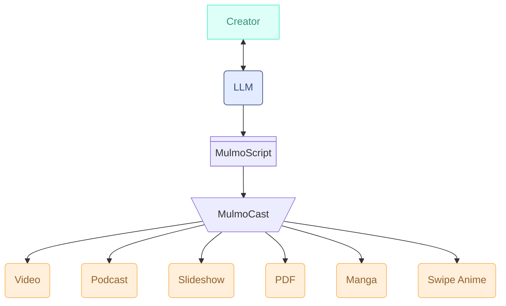

# MulmoCast: A Multi-Modal Presentation Tool for the AI-Native Era

[](https://www.npmjs.com/package/mulmocast)

## Quick Start Guide

If you want to try our beta version, follow the instruction in the release note below.

- [MulmoCast 0.1.x Beta Release Notes](./docs/beta1_en.md)
- [MulmoCast 0.1.x Beta版 リリースノート](./docs/beta1_ja.md)

## What is MulmoCast?

Note: The video version of ["What is MulmoCast?"](https://x.com/mulmocast/status/1924682345065623719) is available on X, which is created by MulmoCast itself.

**MulmoCast** is a next-generation presentation platform, purpose-built for a world where AI and humans collaborate to create and share ideas.

Unlike traditional tools like PowerPoint or Keynote—both designed in the pre-AI era for human creators—MulmoCast is AI-native: reimagined from the ground up to work hand-in-hand with generative AI that understands and produces natural language, images, audio, and video.

As AI takes on an increasingly central role in content creation, it needs more than raw capability—it needs an environment designed for its strengths. MulmoCast provides that environment, empowering AI to generate rich, coherent presentations across multiple formats, while keeping humans in the creative loop.

At the core of MulmoCast is **MulmoScript**, a JSON-based intermediate language that functions like a screenplay or web markup. Generated by large language models, MulmoScript defines everything from narrative structure to visuals, making it easy to produce presentations that adapt seamlessly across formats.



In today’s world, people consume information through many channels—on Zoom calls, in Slack threads, via videos on the go, or through podcasts during commutes. Presentations can no longer be confined to a single format or device. That’s why MulmoCast is built to be truly multi-modal, enabling output not only as slide decks but also as videos, podcasts, manga-style comics, and PDF documents.

Whether you're building a podcast from a research report or turning a business pitch into a narrated video, MulmoCast transforms source material into dynamic, multi-format content with the help of state-of-the-art AI like ChatGPT and Claude.

MulmoCast isn't just a tool. It’s a new foundation for communication—one where humans and AI co-create across every mode of expression.

## MulmoScript

**MulmoScript** is a simple JSON/YAML format for describing multi-modal content.  
You can define speakers, text, images, and layout — all in one script.

Here is the "Hello World" in MulmoScript.

```JSON
{
  "$mulmocast": {
    "version": "1.0"
  },
  "beats": [
    { "text": "Hello World" }
  ]
}
```

See [MulmoScript Format](#mulmoscript-format) for details on the structure.

## Installation

```bash
npm install -g mulmocast
```

You'll also need to install ffmpeg:
```bash
# For macOS with Homebrew
brew install ffmpeg

# For other platforms
# Visit https://ffmpeg.org/download.html
```

You can also use [`Dockerfile`](./Dockerfile) which helps you install the pre-requisits.
```
docker build -t mulmo-cli .
```

You can use the Docker image like this:
```
docker run -e OPENAI_API_KEY=<your_openai_api_key> -it mulmo-cli mulmo tool scripting -i -t children_book -o ./ -s story
```

## Configuration

Create a `.env` file in your project directory with the following API keys:

### Required
```bash
OPENAI_API_KEY=your_openai_api_key
```

#### (Optional) For the advanced image generation model
```bash
DEFAULT_OPENAI_IMAGE_MODEL=gpt-image-1 # for the advanced image generation model
```

#### (Optional) For Google's image and TTS.
```bash
GEMINI_API_KEY=your_google_gemini_api_key
```

#### (Optional) For AI providers
```bash
# For Anthropic Claude (htmlPrompt feature)
ANTHROPIC_API_TOKEN=your_anthropic_api_token
```

For htmlPrompt configuration, see [docs/image.md](./docs/image.md#2-htmlprompt).

#### (Optional) For Movie models
```bash
REPLICATE_API_TOKEN=your_replicate_api_key
```

#### (Optional) For TTS models
```bash
# For ElevenLabs TTS
ELEVENLABS_API_KEY=your_elevenlabs_api_key
```

#### (Optional) to access web in mulmo tool
```bash
BROWSERLESS_API_TOKEN=your_browserless_api_token # to access web in mulmo tool
```

### Google Vertex AI

For enterprise/production environments or to access models like Imagen 4, use Vertex AI with Application Default Credentials (ADC):

```bash
# Install gcloud CLI and authenticate
gcloud auth application-default login
```

Configure in MulmoScript:
```json
{
  "imageParams": {
    "provider": "google",
    "model": "imagen-4.0-generate-001",
    "vertexai_project": "your-project-id",
    "vertexai_location": "us-central1"
  }
}
```

| Parameter | Description | Default |
|-----------|-------------|---------|
| `vertexai_project` | Google Cloud Project ID | None (enables Vertex AI mode when set) |
| `vertexai_location` | Region | `us-central1` |

For detailed setup instructions, see [Vertex AI Setup Guide](./docs/vertexai_en.md).

### Azure OpenAI

To use Azure OpenAI instead of OpenAI API:

```bash
# For image generation
IMAGE_OPENAI_API_KEY=<your-azure-openai-api-key>
IMAGE_OPENAI_BASE_URL=https://<resource-name>.openai.azure.com/

# For TTS (Text-to-Speech)
TTS_OPENAI_API_KEY=<your-azure-openai-api-key>
TTS_OPENAI_BASE_URL=https://<resource-name>.openai.azure.com/

# For LLM (translate, scripting)
LLM_OPENAI_API_KEY=<your-azure-openai-api-key>
LLM_OPENAI_BASE_URL=https://<resource-name>.openai.azure.com/
LLM_OPENAI_API_VERSION=2025-04-01-preview  # optional
```

MulmoScript configuration (same as OpenAI):
```json
{
  "imageParams": {
    "provider": "openai",
    "model": "gpt-image-1.5"
  },
  "speechParams": {
    "speakers": {
      "Presenter": {
        "provider": "openai",
        "voiceId": "alloy",
        "model": "tts"
      }
    }
  }
}
```

**Important**: Azure deployment names must match model names exactly (e.g., deployment name `gpt-image-1.5` for model `gpt-image-1.5`).

For detailed setup and region availability, see [Azure OpenAI Usage Guide](./docs/azure_openai_usage.md).

### mulmo.config.json

Create a `mulmo.config.json` file to set project-wide defaults. The CLI searches for it in **CWD** first, then **home directory (`~/`)**.

```json
{
  "speechParams": {
    "provider": "elevenlabs"
  },
  "imageParams": {
    "provider": "google"
  },
  "audioParams": {
    "bgm": { "kind": "path", "path": "assets/bgm.mp3" },
    "bgmVolume": 0.15
  }
}
```

Top-level keys are applied as **defaults** (script values take precedence). Use the `override` key to **force** values over scripts — useful for enterprise branding or TTS provider enforcement:

```json
{
  "speechParams": {
    "provider": "elevenlabs"
  },
  "override": {
    "speechParams": {
      "provider": "elevenlabs",
      "model": "eleven_multilingual_v2",
      "speakers": {
        "Presenter": { "provider": "elevenlabs", "voiceId": "Rachel" }
      }
    }
  }
}
```

Priority chain: `config (defaults)` < `template/style` < `script` < `config.override` < `presentationStyle (-p)`

Verify the merged result with:
```bash
mulmo tool info merged --script <script.json>
```

## Workflow

1. Create a MulmoScript JSON file with `mulmo tool scripting`
2. Generate audio with `mulmo audio`
3. Generate images with `mulmo images` 
4. Create final video with `mulmo movie`

## Quick Start
### Step 1: Generate a MulmoScript with interactive mode
- Step 1-1: Run the script generation command
  ```bash
  mulmo tool scripting -i -t children_book -o ./ -s story
  ```
  This will initiate the script creation process.
  
- Step 1-2: Interactive conversation with AI

  After running the command, you'll engage in an interactive conversation with the AI to create your story script. The AI will guide you through the process and help shape your content based on your inputs. Once completed, a JSON file (like ⁠`story-1746600802426.json`) will be generated.

### Step 2: Generate both audio and images, then combine into video
```bash
mulmo movie {generated_script_file}
```
Replace `{generated_script_file}` with the output file from STEP 1, such as `story-1746600802426.json`.

Optionally, you can specify *__clipboard* as the script file name to paste the script from the clipboard, which is generated by other interactive environment such as ChatGPT or Claude.

## Quick Start for Ghibli-Style Animation

[](https://www.youtube.com/watch?v=gz_Oe5p2n3s)  
*Click the image above to watch an example of what you can create*

### Step 1: Check/Update Environment Setup
Verify your `.env` file contains:
```bash
OPENAI_API_KEY=your_openai_api_key
DEFAULT_OPENAI_IMAGE_MODEL=gpt-image-1 # required for high-quality Ghibli-style images
```

> **Note:** Ensure your OpenAI organization is verified to access the gpt-image-1 model. Visit https://platform.openai.com/settings/organization/general and complete the "Verifications" section.

### Step 2: Generate a Ghibli-style MulmoScript
```bash
mulmo tool scripting -i -t ghibli_comic -o ./ -s story
```
This will initiate an interactive conversation with the AI to create your Ghibli-inspired story. Once completed, a JSON file (e.g., `story-1747834931950.json`) will be generated.

### Step 3: Translate the MulmoScript
```bash
mulmo translate {generated_script_file_from_step_2}
```

### Step 4: Generate video with Japanese subtitles
```bash
mulmo movie {generated_script_file_from_step_2} -c ja
```
The `-c ja` flag adds Japanese subtitles to your video.

When the process completes, the CLI will display the path to your generated video file:
```bash
Video created successfully! 14.939 sec
writing: /Users/username/path/to/output/story-1747834931950__ja.mp4
```

## Generate MulmoScript

```bash
# Generate script from web content (requires Browserless API KEY)
mulmo tool scripting -u https://example.com

# Generate script from local file
mulmo tool scripting --input-file story.txt

# Generate script with interactive mode
mulmo tool scripting -i
```

Note:

- When -i is specified, --input-file value will be ignored
- When --input-file is specified, -u value will be ignored

### Complete MulmoScript from minimal beats

You can create a minimal JSON with just beats and complete it with `mulmo tool complete`:

```json
{
  "beats": [
    { "text": "Hello, welcome to MulmoCast!" },
    { "text": "This is a simple example." }
  ]
}
```

Save this as `my_beats.json`, then complete it with a style:

```bash
# Complete with built-in style
mulmo tool complete my_beats.json -s ani

# Complete with custom style file
mulmo tool complete my_beats.json -s ./my_style.json

# Output to specific file
mulmo tool complete my_beats.json -s ani -o my_script.json
```

This generates a complete MulmoScript with all required fields (canvasSize, speechParams, imageParams, etc.) from the style.


## Generate content from MulmoScript

Mulmo provides several commands to handle different aspects of content creation:

```bash
# Generate audio from script
mulmo audio script.json

# Generate images for script
mulmo images script.json

# Generate both audio and images, then combine into video
mulmo movie script.json

# Translate script to Japanese
mulmo translate script.json
```

## Cache and Re-run
When running the same `mulmo` command multiple times, previously generated files are treated as cache. For example, audio or image files will not be regenerated if they already exist.

To force regeneration, delete the old files — including temporary files — under the output directory before re-running the command or use -f (force) option.

If you modify the text or instruction fields in a MulmoScript, mulmo will automatically detect the changes and regenerate the corresponding audio content upon re-run.

## Slide Presentations

MulmoCast includes a powerful **Slide DSL** (`type: "slide"`) for creating structured presentation slides with JSON. Slides are rendered via Tailwind CSS + Puppeteer into images.

### Features

- **11 Layouts**: title, columns, comparison, grid, bigQuote, stats, timeline, split, matrix, table, funnel
- **10 Content Block Types**: text, bullets, code, callout, metric, divider, image, imageRef, chart, mermaid
- **13-Color Theme System**: Semantic color palette with dark/light support
- **6 Preset Themes**: dark, pop, warm, creative, minimal, corporate

### Usage

Set a theme once with `slideParams.theme`, then use `"type": "slide"` in each beat:

```json
{
  "$mulmocast": { "version": "1.1" },
  "slideParams": {
    "theme": { "colors": { "bg": "0F172A", "bgCard": "1E293B", "bgCardAlt": "334155", "text": "F8FAFC", "textMuted": "CBD5E1", "textDim": "64748B", "primary": "3B82F6", "accent": "8B5CF6", "success": "22C55E", "warning": "F59E0B", "danger": "EF4444", "info": "14B8A6", "highlight": "EC4899" }, "fonts": { "title": "Georgia", "body": "Calibri", "mono": "Consolas" } }
  },
  "beats": [
    {
      "text": "Welcome to the presentation",
      "image": {
        "type": "slide",
        "slide": { "layout": "title", "title": "Main Title", "subtitle": "Subtitle" }
      }
    }
  ]
}
```

Or use a preset presentation style:

```bash
mulmo tool complete beats.json -s slide_dark -o presentation.json
```

Available preset styles: `slide_dark`, `slide_pop`, `slide_warm`, `slide_creative`, `slide_minimal`, `slide_corporate`

For detailed layout specifications and content block reference, see the [Slide DSL documentation](./.claude/skills/slide/SKILL.md).

## Markdown Slide Styles

MulmoCast includes 100 pre-designed CSS styles for markdown slides, organized in 10 categories:

| Category | Description | Example Styles |
|----------|-------------|----------------|
| business | Professional corporate designs | corporate-blue, executive-gray, finance-green |
| tech | Technology and developer themes | cyber-neon, matrix-green, terminal-dark |
| creative | Artistic and expressive styles | artistic-splash, watercolor-soft, graffiti |
| minimalist | Clean and simple designs | clean-white, zen-beige, nordic-light |
| nature | Nature-inspired themes | forest-green, ocean-blue, sunset-orange |
| dark | Dark mode and elegant themes | charcoal-elegant, midnight-blue, obsidian |
| colorful | Vibrant and bold colors | vibrant-pink, candy-colors, aurora |
| vintage | Retro and classic styles | retro-70s, art-deco, typewriter |
| japanese | Japanese aesthetic designs | washi-paper, sakura-pink, zen-garden |
| geometric | Pattern-based designs | hexagon-pattern, isometric, bauhaus |

### Usage

Add the `style` property to a markdown beat:

```json
{
  "beats": [
    {
      "text": "Corporate presentation slide",
      "image": {
        "type": "markdown",
        "markdown": "# Quarterly Report\n\n## Key Highlights\n\n- Revenue up 15%\n- New market expansion\n- Team growth",
        "style": "corporate-blue"
      }
    }
  ]
}
```

### Discover Available Styles

Use the `mulmo tool info` command to see all available styles:

```bash
mulmo tool info styles
```

## MulmoScript Format

MulmoScript is a JSON format to define podcast or video scripts:
Schema definition: [schema.ts](./src/types/schema.ts)

## Sample MulmoScript

https://github.com/receptron/mulmocast-cli/tree/main/scripts

## Directory Structure

| Directory         | Description                                                                 |
|-------------------|-----------------------------------------------------------------------------|
| `output/`         | Artifacts generated by commands — e.g., `.json`, audio, and video files    |
| `output/audio/`   | Temporary audio fragments used in the final audio assembly                  |
| `output/images/`  | Image files generated by the `images` command                               |
| `output/cache/`   | Internal cache files for various processing steps                           |

> These directories are automatically created as needed by the `mulmo` commands.

## Help

CLI Usage


```
mulmo <command> [options]

Commands:
  mulmo translate <file>  Translate Mulmo script
  mulmo audio <file>      Generate audio files
  mulmo images <file>     Generate image files
  mulmo movie <file>      Generate movie file
  mulmo pdf <file>        Generate PDF files
  mulmo markdown <file>   Generate markdown files
  mulmo html <file>       Generate html files
  mulmo tool <command>    Generate Mulmo script and other tools

Options:
      --version  Show version number                                   [boolean]
  -v, --verbose  verbose log               [boolean] [required] [default: false]
  -h, --help     Show help                                             [boolean]
```

```
mulmo translate <file>

Translate Mulmo script

Positionals:
  file  Mulmo Script File                                    [string] [required]

Options:
      --version  Show version number                                   [boolean]
  -v, --verbose  verbose log               [boolean] [required] [default: false]
  -h, --help     Show help                                             [boolean]
  -o, --outdir   output dir                                             [string]
  -b, --basedir  base dir                                               [string]
  -l, --lang     target language                  [string] [choices: "en", "ja"]
  -f, --force    Force regenerate                     [boolean] [default: false]
```

```
mulmo audio <file>

Generate audio files

Positionals:
  file  Mulmo Script File                                    [string] [required]

Options:
      --version            Show version number                         [boolean]
  -v, --verbose            verbose log     [boolean] [required] [default: false]
  -h, --help               Show help                                   [boolean]
  -o, --outdir             output dir                                   [string]
  -b, --basedir            base dir                                     [string]
  -l, --lang               target language        [string] [choices: "en", "ja"]
  -f, --force              Force regenerate           [boolean] [default: false]
  -p, --presentationStyle  Presentation Style                           [string]
  -a, --audiodir           Audio output directory                       [string]
```

```
mulmo images <file>

Generate image files

Positionals:
  file  Mulmo Script File                                    [string] [required]

Options:
      --version            Show version number                         [boolean]
  -v, --verbose            verbose log     [boolean] [required] [default: false]
  -h, --help               Show help                                   [boolean]
  -o, --outdir             output dir                                   [string]
  -b, --basedir            base dir                                     [string]
  -l, --lang               target language        [string] [choices: "en", "ja"]
  -f, --force              Force regenerate           [boolean] [default: false]
  -p, --presentationStyle  Presentation Style                           [string]
  -i, --imagedir           Image output directory                       [string]
```

```
mulmo movie <file>

Generate movie file

Positionals:
  file  Mulmo Script File                                    [string] [required]

Options:
      --version            Show version number                         [boolean]
  -v, --verbose            verbose log     [boolean] [required] [default: false]
  -h, --help               Show help                                   [boolean]
  -o, --outdir             output dir                                   [string]
  -b, --basedir            base dir                                     [string]
  -l, --lang               target language        [string] [choices: "en", "ja"]
  -f, --force              Force regenerate           [boolean] [default: false]
  -p, --presentationStyle  Presentation Style                           [string]
  -a, --audiodir           Audio output directory                       [string]
  -i, --imagedir           Image output directory                       [string]
  -c, --caption            Video captions         [string] [choices: "en", "ja"]
```

```
mulmo pdf <file>

Generate PDF files

Positionals:
  file  Mulmo Script File                                    [string] [required]

Options:
      --version            Show version number                         [boolean]
  -v, --verbose            verbose log     [boolean] [required] [default: false]
  -h, --help               Show help                                   [boolean]
  -o, --outdir             output dir                                   [string]
  -b, --basedir            base dir                                     [string]
  -l, --lang               target language        [string] [choices: "en", "ja"]
  -f, --force              Force regenerate           [boolean] [default: false]
      --dryRun             Dry run                    [boolean] [default: false]
  -p, --presentationStyle  Presentation Style                           [string]
  -i, --imagedir           Image output directory                       [string]
      --pdf_mode           PDF mode
               [string] [choices: "slide", "talk", "handout"] [default: "slide"]
      --pdf_size           PDF paper size (default: letter)
                                   [choices: "letter", "a4"] [default: "letter"]
```

```
mulmo markdown <file>

Generate markdown files

Positionals:
  file  Mulmo Script File                                    [string] [required]

Options:
      --version            Show version number                         [boolean]
  -v, --verbose            verbose log     [boolean] [required] [default: false]
  -h, --help               Show help                                   [boolean]
  -o, --outdir             output dir                                   [string]
  -b, --basedir            base dir                                     [string]
  -l, --lang               target language
  [string] [choices: "en", "ja", "fr", "es", "de", "zh-CN", "zh-TW", "ko", "it",
                                                               "pt", "ar", "hi"]
  -f, --force              Force regenerate           [boolean] [default: false]
  -p, --presentationStyle  Presentation Style                           [string]
      --image_width        Image width (e.g., 400px, 50%, auto)         [string]
```

```
mulmo html <file>

Generate html files

Positionals:
  file  Mulmo Script File                                    [string] [required]

Options:
      --version            Show version number                         [boolean]
  -v, --verbose            verbose log     [boolean] [required] [default: false]
  -h, --help               Show help                                   [boolean]
  -o, --outdir             output dir                                   [string]
  -b, --basedir            base dir                                     [string]
  -l, --lang               target language
  [string] [choices: "en", "ja", "fr", "es", "de", "zh-CN", "zh-TW", "ko", "it",
                                                               "pt", "ar", "hi"]
  -f, --force              Force regenerate           [boolean] [default: false]
  -p, --presentationStyle  Presentation Style                           [string]
      --image_width        Image width (e.g., 400px, 50%, auto)         [string]
```

```
mulmo bundle <file>

Generate bundle files

Positionals:
  file  Mulmo Script File                                    [string] [required]

Options:
      --version            Show version number                         [boolean]
  -v, --verbose            verbose log     [boolean] [required] [default: false]
  -h, --help               Show help                                   [boolean]
  -o, --outdir             output dir                                   [string]
  -b, --basedir            base dir                                     [string]
  -l, --lang               target language
  [string] [choices: "en", "ja", "fr", "es", "de", "zh-CN", "zh-TW", "ko", "it",
                                                               "pt", "ar", "hi"]
  -f, --force              Force regenerate           [boolean] [default: false]
      --backup             create backup media file   [boolean] [default: false]
  -p, --presentationStyle  Presentation Style                           [string]
```

```
mulmo tool <command>

Generate Mulmo script and other tools

Commands:
  mulmo tool scripting       Generate mulmocast script
  mulmo tool complete <file> Complete partial MulmoScript with defaults
  mulmo tool prompt          Dump prompt from template
  mulmo tool schema          Dump mulmocast schema
  mulmo tool info [category] Show available options (styles, bgm, voices, etc.)

Options:
      --version  Show version number                                   [boolean]
  -v, --verbose  verbose log               [boolean] [required] [default: false]
  -h, --help     Show help                                             [boolean]
```

```
mulmo tool scripting

Generate mulmocast script

Options:
      --version      Show version number                               [boolean]
  -v, --verbose      verbose log           [boolean] [required] [default: false]
  -h, --help         Show help                                         [boolean]
  -o, --outdir       output dir                                         [string]
  -b, --basedir      base dir                                           [string]
  -u, --url          URLs to reference (required when not in interactive mode)
                                                           [array] [default: []]
      --input-file   input file name                                    [string]
  -i, --interactive  Generate script in interactive mode with user prompts
                                                                       [boolean]
  -t, --template     Template name to use
        [string] [choices: "akira_comic", "business", "children_book", "coding",
           "comic_strips", "drslump_comic", "ghibli_comic", "ghibli_image_only",
           "ghibli_shorts", "ghost_comic", "onepiece_comic", "podcast_standard",
               "portrait_movie", "realistic_movie", "sensei_and_taro", "shorts",
                                       "text_and_image", "text_only", "trailer"]
  -c, --cache        cache dir                                          [string]
  -s, --script       script filename                [string] [default: "script"]
      --llm          llm
                     [string] [choices: "openai", "anthropic", "gemini", "groq"]
      --llm_model    llm model                                          [string]
```

```
mulmo tool story_to_script <file>

Generate Mulmo script from story

Positionals:
  file  story file path                                      [string] [required]

Options:
      --version          Show version number                           [boolean]
  -v, --verbose          verbose log       [boolean] [required] [default: false]
  -h, --help             Show help                                     [boolean]
  -o, --outdir           output dir                                     [string]
  -b, --basedir          base dir                                       [string]
  -t, --template         Template name to use
       [string] [choices: "business", "children_book", "coding", "comic_strips",
                         "ghibli_strips", "podcast_standard", "sensei_and_taro"]
  -s, --script           script filename            [string] [default: "script"]
      --beats_per_scene  beats per scene                   [number] [default: 3]
      --llm              llm
                     [string] [choices: "openAI", "anthropic", "gemini", "groq"]
      --llm_model        llm model                                      [string]
      --mode             story to script generation mode
              [string] [choices: "step_wise", "one_step"] [default: "step_wise"]
```

```
mulmo tool prompt

Dump prompt from template

Options:
      --version   Show version number                                  [boolean]
  -v, --verbose   verbose log              [boolean] [required] [default: false]
  -h, --help      Show help                                            [boolean]
  -t, --template  Template name to use
       [string] [choices: "business", "children_book", "coding", "comic_strips",
                         "ghibli_strips", "podcast_standard", "sensei_and_taro"]
```

```
mulmo tool schema

Dump mulmocast schema

Options:
      --version  Show version number                                   [boolean]
  -v, --verbose  verbose log               [boolean] [required] [default: false]
  -h, --help     Show help                                             [boolean]
```

```
mulmo tool complete <file>

Complete partial MulmoScript with schema defaults and optional style/template

Positionals:
  file  Input beats file path (JSON)                             [string] [required]

Options:
      --version   Show version number                                    [boolean]
  -v, --verbose   verbose log                [boolean] [required] [default: false]
  -h, --help      Show help                                              [boolean]
  -o, --output    Output file path (default: <file>_completed.json)       [string]
  -t, --template  Template name to apply                                  [string]
  -s, --style     Style name or file path (.json)                         [string]

Examples:
  # Complete minimal script with schema defaults
  mulmo tool complete input.json

  # Apply built-in style
  mulmo tool complete input.json -s ani

  # Apply custom style file
  mulmo tool complete input.json -s ./my_style.json

  # Apply template
  mulmo tool complete input.json -t children_book
```

```
mulmo tool info [category]

Show available options for MulmoScript configuration

Positionals:
  category  Category to show info for
    [string] [choices: "styles", "bgm", "templates", "voices", "images", "movies", "llm"]

Options:
      --version  Show version number                                   [boolean]
  -v, --verbose  verbose log               [boolean] [required] [default: false]
  -h, --help     Show help                                             [boolean]
  -F, --format   Output format      [string] [choices: "text", "json", "yaml"]

Examples:
  # Show all available categories
  mulmo tool info

  # List all 100 markdown styles
  mulmo tool info styles

  # List available BGM assets
  mulmo tool info bgm

  # List TTS providers and voices
  mulmo tool info voices

  # Output as JSON for programmatic use
  mulmo tool info styles --format json
```


## Contributing

For developers interested in contributing to this project, please see [CONTRIBUTING.md](./CONTRIBUTING.md).

